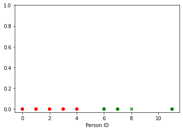
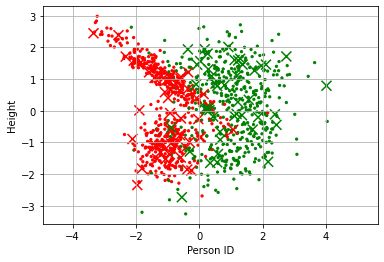
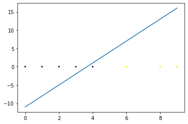

# Classifiers
Classifiers put the data into differnt groups or "classes". This repository includes the K-Nearest Neighbors Classifier and the Perceptron Classifier. 

# K-Nearest Neighbors Classifier
K-Nearest Neighbors Classifier using Scikit-learn
The algorithm finds the nearest neighbors based on the number of features we give it. Then, if we plot a point, the algorithm should be able to see which class it is in. 

On the left, the plot shows the data with only one feature in a line. On the right, the plot shows the data with two features. 
The circles show the training data and the X shows the testing data in both plots.

### References

[K-Nearest Neighbors Algorithm on Wikipedia](https://en.wikipedia.org/wiki/K-nearest_neighbors_algorithm)

[K-Nearest Neighbor Classifier using Scikit-learn](https://scikit-learn.org/stable/modules/generated/sklearn.neighbors.KNeighborsClassifier.html)

[Generation of classification data using Scikit-learn](https://scikit-learn.org/stable/modules/generated/sklearn.datasets.make_classification.html)

# Perceptron Classifier
Perceptron Classifier using Scikit-learn
This algorithm is very simple. Its goal is to plot a straigt line through the data to split the data into 2 parts. 

In the image above, the Perceptron algorithm draws a line though the data. The data is split in to purple and yellow. 
